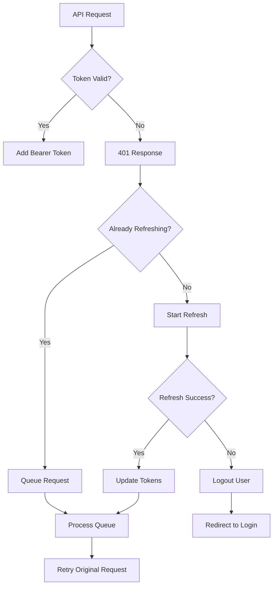

# HTTP Client Documentation

## Overview

The HTTP Client is a robust, low-level HTTP communication layer built on top of Axios for the Crop Disease Detection System. It provides automatic authentication, token management, request retrying, error handling, and response transformation with secure token storage integration.

## Features

### 🔐 **Authentication Management**

- **Automatic token injection** in request headers
- **Token refresh** when expired (401 responses)
- **Secure token storage** integration
- **Request queuing** during token refresh

### 🔄 **Request Management**

- **Automatic retry** with exponential backoff
- **Request/response interceptors** for cross-cutting concerns
- **Timeout handling** for hung requests
- **Request cancellation** support

### 🛡️ **Error Handling**

- **Comprehensive error transformation**
- **Smart retry logic** (avoids retrying client errors)
- **Network error detection**
- **Standardized error responses**

### 📊 **Response Processing**

- **Consistent response format** transformation
- **Automatic timestamp addition**
- **Status code normalization**
- **Data extraction** from nested response structures

## Architecture

### File Structure

```
src/
├── services/
│   └── http.client.ts          # HTTP client implementation
├── config/
│   └── api.config.ts           # API configuration
├── interfaces/
│   └── api.types.ts            # HTTP types and interfaces
└── utils/
    └── secureStorage.ts        # Token storage utilities
```

### Dependencies

- **Axios**: HTTP client library
- **AuthSecureStorage**: Token storage utilities
- **TypeScript**: Type safety and interfaces

## Class Interface

```typescript
class HttpClient {
  // Private properties
  private instance: AxiosInstance;
  private token: string | null;
  private refreshToken: string | null;
  private isRefreshing: boolean;
  private failedQueue: Array<{ resolve: Function; reject: Function }>;

  // Public methods
  constructor();
  setAuthTokens(token: string, refreshToken: string): void;
  clearAuthTokens(): void;
  request<T>(
    config: AxiosRequestConfig,
    options?: RequestOptions
  ): Promise<ApiResponse<T>>;
  get<T>(
    url: string,
    config?: AxiosRequestConfig,
    options?: RequestOptions
  ): Promise<ApiResponse<T>>;
  post<T>(
    url: string,
    data?: any,
    config?: AxiosRequestConfig,
    options?: RequestOptions
  ): Promise<ApiResponse<T>>;
  put<T>(
    url: string,
    data?: any,
    config?: AxiosRequestConfig,
    options?: RequestOptions
  ): Promise<ApiResponse<T>>;
  patch<T>(
    url: string,
    data?: any,
    config?: AxiosRequestConfig,
    options?: RequestOptions
  ): Promise<ApiResponse<T>>;
  delete<T>(
    url: string,
    config?: AxiosRequestConfig,
    options?: RequestOptions
  ): Promise<ApiResponse<T>>;
}
```

## Core Components

### **Constructor & Initialization**

```typescript
constructor() {
  const config = getApiConfig();

  this.instance = axios.create({
    baseURL: config.BASE_URL,
    timeout: config.TIMEOUT,
    headers: config.DEFAULT_HEADERS,
  });

  this.setupInterceptors();
  this.loadTokens();
}
```

**What it does:**

- Creates Axios instance with base configuration
- Sets up request/response interceptors
- Loads stored authentication tokens

### **Request Interceptor**

```typescript
this.instance.interceptors.request.use(
  (config) => {
    // Add auth token if available
    if (this.token) {
      config.headers.Authorization = `Bearer ${this.token}`;
    }

    // Add request timestamp
    config.headers["X-Request-Timestamp"] = new Date().toISOString();

    return config;
  },
  (error) => Promise.reject(error)
);
```

**Features:**

- Automatically injects Bearer token
- Adds request timestamps for debugging
- Handles request configuration errors

### **Response Interceptor**

```typescript
this.instance.interceptors.response.use(
  (response: AxiosResponse) => response,
  async (error: AxiosError) => {
    const originalRequest = error.config as any;

    if (error.response?.status === 401 && !originalRequest._retry) {
      // Handle token refresh logic
      return this.handleTokenRefresh(originalRequest);
    }

    return Promise.reject(error);
  }
);
```

**Features:**

- Detects 401 (Unauthorized) responses
- Automatically refreshes tokens
- Retries failed requests after token refresh
- Prevents infinite retry loops

## Authentication Flow

### **Token Management**

```typescript
// Set authentication tokens
setAuthTokens(token: string, refreshToken: string): void {
  this.token = token;
  this.refreshToken = refreshToken;
  this.saveTokens(token, refreshToken);
}

// Clear authentication tokens
clearAuthTokens(): void {
  this.token = null;
  this.refreshToken = null;
  this.logout();
}
```

### **Token Refresh Process**



### **Failed Request Queuing**

```typescript
private failedQueue: {
  resolve: (value: any) => void;
  reject: (error: any) => void;
}[] = [];

// During token refresh, queue failed requests
if (this.isRefreshing) {
  return new Promise((resolve, reject) => {
    this.failedQueue.push({ resolve, reject });
  }).then(() => {
    return this.instance(originalRequest);
  });
}
```

**Benefits:**

- Prevents multiple simultaneous refresh attempts
- Ensures all pending requests are retried after refresh
- Maintains request order and context

## Request Processing

### **Generic Request Method**

```typescript
async request<T>(
  config: AxiosRequestConfig,
  options: RequestOptions = {}
): Promise<ApiResponse<T>> {
  const {
    timeout = API_CONFIG.TIMEOUT,
    retryAttempts = API_CONFIG.RETRY_ATTEMPTS,
    retryDelay = API_CONFIG.RETRY_DELAY,
    headers = {},
    signal,
  } = options;

  let lastError: AxiosError;

  for (let attempt = 0; attempt <= retryAttempts; attempt++) {
    try {
      const response = await this.instance.request({
        ...config,
        timeout,
        headers: { ...config.headers, ...headers },
        signal,
      });

      return this.transformResponse<T>(response);
    } catch (error) {
      lastError = error as AxiosError;

      // Don't retry on certain errors
      if (this.shouldNotRetry(error as AxiosError)) {
        break;
      }

      // Wait before retrying (except on last attempt)
      if (attempt < retryAttempts) {
        await this.delay(retryDelay * Math.pow(2, attempt)); // Exponential backoff
      }
    }
  }

  return this.transformError<T>(lastError!);
}
```

### **Retry Logic**

```typescript
private shouldNotRetry(error: AxiosError): boolean {
  const status = error.response?.status;

  // Don't retry on client errors (4xx) except 408, 429
  if (status && status >= 400 && status < 500 && ![408, 429].includes(status)) {
    return true;
  }

  // Don't retry on network errors
  if (!error.response && !error.request) {
    return true;
  }

  return false;
}
```

**Retry Strategy:**

- **Exponential backoff**: 1s, 2s, 4s, 8s intervals
- **Smart filtering**: Only retry recoverable errors
- **Configurable**: Customizable attempts and delays

## Response Transformation

### **Success Response**

```typescript
private transformResponse<T>(response: AxiosResponse): ApiResponse<T> {
  return {
    success: true,
    data: response.data.data || response.data,
    message: response.data.message,
    statusCode: response.status,
    timestamp: new Date().toISOString(),
  };
}
```

**Features:**

- Extracts data from nested response structures
- Adds consistent timestamp
- Preserves status codes and messages

### **Error Response**

```typescript
private transformError<T>(error: AxiosError): ApiResponse<T> {
  const apiError: ApiError = {
    code: this.getErrorCode(error),
    message: this.getErrorMessage(error),
    details: error.response?.data,
    timestamp: new Date().toISOString(),
  };

  return {
    success: false,
    error: apiError,
    statusCode: error.response?.status,
    timestamp: new Date().toISOString(),
  };
}
```

**Features:**

- Standardizes error format across all responses
- Extracts meaningful error messages
- Preserves original error details for debugging

## HTTP Method Shortcuts

### **GET Request**

```typescript
async get<T>(
  url: string,
  config?: AxiosRequestConfig,
  options?: RequestOptions
): Promise<ApiResponse<T>> {
  return this.request<T>({ ...config, method: 'GET', url }, options);
}
```

### **POST Request**

```typescript
async post<T>(
  url: string,
  data?: any,
  config?: AxiosRequestConfig,
  options?: RequestOptions
): Promise<ApiResponse<T>> {
  return this.request<T>({ ...config, method: 'POST', url, data }, options);
}
```

### **File Upload Handling**

```typescript
// Automatically detects FormData and sets appropriate headers
const formData = new FormData();
formData.append("file", fileBlob);

const response = await httpClient.post<UploadResponse>("/upload", formData, {
  headers: {
    "Content-Type": "multipart/form-data",
  },
});
```

## Usage Examples

### **1. Basic Request**

```typescript
import { httpClient } from "../services/http.client";

const fetchUserProfile = async () => {
  try {
    const response = await httpClient.get<User>("/user/profile");

    if (response.success) {
      console.log("User:", response.data);
      return response.data;
    } else {
      console.error("Error:", response.error);
      throw new Error(response.error?.message || "Failed to fetch profile");
    }
  } catch (error) {
    console.error("Network error:", error);
    throw error;
  }
};
```

### **2. Custom Request Options**

```typescript
const uploadLargeFile = async (fileData: FormData) => {
  const response = await httpClient.post<UploadResult>(
    "/upload/large",
    fileData,
    {
      headers: {
        "Content-Type": "multipart/form-data",
      },
    },
    {
      timeout: 60000, // 60 second timeout
      retryAttempts: 3, // 3 retry attempts
      retryDelay: 2000, // 2 second base delay
    }
  );

  return response;
};
```

### **3. Request Cancellation**

```typescript
const CancellableComponent = () => {
  const [controller, setController] = useState<AbortController | null>(null);

  const fetchData = async () => {
    // Cancel previous request if exists
    if (controller) {
      controller.abort();
    }

    const newController = new AbortController();
    setController(newController);

    try {
      const response = await httpClient.get<DataType>(
        "/api/data",
        {},
        { signal: newController.signal }
      );

      if (response.success) {
        setData(response.data);
      }
    } catch (error) {
      if (error.name !== "AbortError") {
        console.error("Request failed:", error);
      }
    }
  };

  useEffect(() => {
    return () => {
      // Cleanup on unmount
      if (controller) {
        controller.abort();
      }
    };
  }, [controller]);
};
```

### **4. Authentication Integration**

```typescript
import { useAuthStore } from "../store/auth.store";

const AuthenticatedRequest = () => {
  const { setAuth, logout } = useAuthStore();

  const makeAuthenticatedCall = async () => {
    try {
      // Token is automatically added by HTTP client
      const response = await httpClient.get<ProtectedData>("/protected-data");

      if (response.success) {
        return response.data;
      } else if (response.statusCode === 401) {
        // Token refresh failed, logout user
        await logout();
        // Redirect to login
      }
    } catch (error) {
      console.error("Request failed:", error);
    }
  };
};
```

## Error Handling Patterns

### **Error Types**

```typescript
// Network Error (no response received)
{
  success: false,
  error: {
    code: 'NETWORK_ERROR',
    message: 'Request failed',
    timestamp: '2024-01-15T10:30:00Z'
  },
  statusCode: undefined
}

// HTTP Error (4xx, 5xx responses)
{
  success: false,
  error: {
    code: 'VALIDATION_ERROR',
    message: 'Invalid email format',
    details: { field: 'email', value: 'invalid-email' },
    timestamp: '2024-01-15T10:30:00Z'
  },
  statusCode: 400
}

// Timeout Error
{
  success: false,
  error: {
    code: 'TIMEOUT',
    message: 'Request timeout',
    timestamp: '2024-01-15T10:30:00Z'
  },
  statusCode: undefined
}
```

### **Error Handling Strategy**

```typescript
const handleApiCall = async () => {
  try {
    const response = await httpClient.get<DataType>("/api/endpoint");

    if (response.success) {
      // Handle success
      return response.data;
    } else {
      // Handle API errors
      const error = response.error;

      switch (response.statusCode) {
        case 400:
          // Validation error
          showValidationError(error?.message);
          break;
        case 401:
          // Authentication error
          redirectToLogin();
          break;
        case 403:
          // Permission error
          showPermissionError();
          break;
        case 500:
          // Server error
          showServerError();
          break;
        default:
          // Generic error
          showGenericError(error?.message);
      }

      throw new Error(error?.message || "Request failed");
    }
  } catch (error) {
    // Handle network/unexpected errors
    if (error.name === "AbortError") {
      console.log("Request was cancelled");
    } else {
      console.error("Network error:", error);
      showNetworkError();
    }

    throw error;
  }
};
```

## Configuration Options

### **Request Options Interface**

```typescript
interface RequestOptions {
  timeout?: number; // Request timeout in ms
  retryAttempts?: number; // Number of retry attempts
  retryDelay?: number; // Base delay between retries in ms
  headers?: Record<string, string>; // Additional headers
  signal?: AbortSignal; // Cancellation signal
}
```

### **Default Configuration**

```typescript
const DEFAULT_OPTIONS = {
  timeout: 10000, // 10 seconds
  retryAttempts: 3, // 3 attempts
  retryDelay: 1000, // 1 second base delay
  headers: {
    "Content-Type": "application/json",
    Accept: "application/json",
  },
};
```

### **Environment-Specific Config**

```typescript
const config = getApiConfig();
// Development: localhost with longer timeouts
// Production: actual API URL with standard timeouts
```

## Security Considerations

### **Token Security**

- ✅ **Secure storage**: Tokens stored in device keychain
- ✅ **Automatic injection**: No manual token handling required
- ✅ **Token validation**: Automatic refresh on expiration
- ✅ **Secure cleanup**: Tokens cleared on logout

### **Request Security**

- ✅ **HTTPS enforcement**: Production API uses HTTPS
- ✅ **Timeout protection**: Prevents hanging requests
- ✅ **Input validation**: TypeScript prevents invalid data
- ✅ **Error sanitization**: Sensitive data not exposed in errors

## Performance Optimization

### **Request Optimization**

```typescript
// Exponential backoff prevents server overload
const delay = retryDelay * Math.pow(2, attempt);

// Failed request queuing prevents duplicate token refreshes
if (this.isRefreshing) {
  return this.queueRequest(originalRequest);
}

// Response transformation reduces memory footprint
return {
  success: true,
  data: response.data.data || response.data, // Extract nested data
  // ... other fields
};
```

### **Memory Management**

```typescript
// Automatic cleanup of failed request queue
private processQueue(error: any, token: any): void {
  this.failedQueue.forEach(({ resolve, reject }) => {
    if (error) {
      reject(error);
    } else {
      resolve(token);
    }
  });

  this.failedQueue = []; // Clear queue
}
```

## Testing

### **Unit Testing**

```typescript
import { HttpClient } from "../services/http.client";

describe("HttpClient", () => {
  let httpClient: HttpClient;

  beforeEach(() => {
    httpClient = new HttpClient();
  });

  test("should retry failed requests", async () => {
    const mockAxios = jest.mocked(axios);
    mockAxios.create.mockReturnValue({
      request: jest
        .fn()
        .mockRejectedValueOnce(new Error("Network error"))
        .mockResolvedValue({ data: { data: "success" }, status: 200 }),
    } as any);

    const response = await httpClient.get("/test-endpoint");

    expect(response.success).toBe(true);
    expect(response.data).toBe("success");
  });

  test("should handle token refresh", async () => {
    // Mock 401 response followed by successful refresh
    const mockRequest = jest
      .fn()
      .mockRejectedValueOnce({ response: { status: 401 }, config: {} })
      .mockResolvedValue({ data: { data: "success" }, status: 200 });

    // Test token refresh flow
  });
});
```

### **Integration Testing**

```typescript
describe("HttpClient Integration", () => {
  test("should integrate with auth store", async () => {
    const { result } = renderHook(() => useAuthStore());

    // Set tokens
    await act(async () => {
      await result.current.setAuth(mockAuthData);
    });

    // Make authenticated request
    const response = await httpClient.get("/protected");

    // Verify token was included
    expect(mockAxios.request).toHaveBeenCalledWith(
      expect.objectContaining({
        headers: expect.objectContaining({
          Authorization: expect.stringContaining("Bearer"),
        }),
      })
    );
  });
});
```

## Best Practices

### **1. Use Response Type Safety**

```typescript
// ✅ Good - Use specific types
const response: ApiResponse<User> = await httpClient.get<User>("/user");

// ❌ Bad - Use any type
const response: any = await httpClient.get("/user");
```

### **2. Handle All Response Cases**

```typescript
// ✅ Good - Handle success and error cases
const response = await httpClient.post("/login", credentials);
if (response.success) {
  // Handle success
  processLoginSuccess(response.data);
} else {
  // Handle error
  handleLoginError(response.error);
}

// ❌ Bad - Assume success
const data = response.data; // Might be undefined
```

### **3. Use Appropriate Timeout Values**

```typescript
// ✅ Good - Appropriate timeouts for operation type
const quickResponse = await httpClient.get("/ping", {}, { timeout: 3000 });
const fileUpload = await httpClient.post(
  "/upload",
  formData,
  {},
  { timeout: 60000 }
);

// ❌ Bad - Same timeout for all operations
const response = await httpClient.post("/upload", largeFile); // Uses default 10s timeout
```

### **4. Implement Request Cancellation**

```typescript
// ✅ Good - Cancel requests when component unmounts
useEffect(() => {
  const controller = new AbortController();

  const fetchData = async () => {
    try {
      const response = await httpClient.get(
        "/data",
        {},
        { signal: controller.signal }
      );
      setData(response.data);
    } catch (error) {
      if (error.name !== "AbortError") {
        setError(error.message);
      }
    }
  };

  fetchData();

  return () => controller.abort();
}, []);
```

## Troubleshooting

### **Common Issues**

1. **Requests failing with 401 errors**

   - Check if tokens are properly stored
   - Verify token refresh endpoint
   - Test with valid credentials

2. **Requests timing out**

   - Check network connectivity
   - Increase timeout for slow operations
   - Verify server response times

3. **Retry logic not working**
   - Check if error is retryable
   - Verify retry configuration
   - Monitor retry attempts in logs

### **Debug Mode**

```typescript
if (__DEV__) {
  // Log all requests
  httpClient.instance.interceptors.request.use((config) => {
    console.log("🚀 Request:", {
      method: config.method,
      url: config.url,
      data: config.data,
      headers: config.headers,
    });
    return config;
  });

  // Log all responses
  httpClient.instance.interceptors.response.use(
    (response) => {
      console.log("✅ Response:", {
        status: response.status,
        data: response.data,
        url: response.config.url,
      });
      return response;
    },
    (error) => {
      console.log("❌ Error:", {
        status: error.response?.status,
        message: error.message,
        url: error.config?.url,
      });
      return Promise.reject(error);
    }
  );
}
```

## Migration Guide

### **From Fetch API**

```typescript
// Before: fetch API
const response = await fetch("/api/users", {
  method: "GET",
  headers: {
    Authorization: `Bearer ${token}`,
    "Content-Type": "application/json",
  },
});
const data = await response.json();

// After: HTTP Client
const response = await httpClient.get<User[]>("/users");
if (response.success) {
  const data = response.data;
}
```

### **From Axios Direct Usage**

```typescript
// Before: Direct axios
const response = await axios.get("/api/users", {
  headers: { Authorization: `Bearer ${token}` },
});

// After: HTTP Client
const response = await httpClient.get<User[]>("/users");
// Token automatically added, response standardized
```

## Conclusion

The HTTP Client provides a robust foundation for all HTTP communication in the application. It handles complex scenarios like authentication, retries, and error handling automatically, allowing higher-level code to focus on business logic.

For more information, see:

- [API Service Documentation](./api.service.md)
- [Auth Store Documentation](../store/auth.store.md)
- [Secure Storage Documentation](../utils/secureStorage.md)
